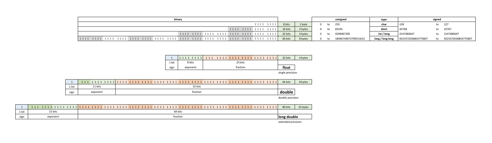

# Ft_Printf - 42 School Project 

## Highlights

* This project is about re-building the printf function with most of its functionality by using only other self-built functions based on the C standard library.

* ft_printf writes output to stdout according to a format and returns the number of characters printed or a negative number in case of error.  

* ft_printf is prototyped similarly to printf: `int ft_printf(const char* format, ...)`

* ft_printf is a variadic function wich means that it can print a varying number of arguments of varying types.

* The string `const char* format` is composed by ordinary characters (not %), which are copied unchanged to the output; and conversion specifications introduced by `%` and ended by the type of conversion which must correspond properly to the next argument in the argument list `...`. The following may appear in a conversion sequence: 

  `%[argument][flag][width][precision][length]type`
  
* ft_printf is a great opportunity to implement a basic 'dispatcher' in C via the use of an array of function’s pointers. 

## Supported in this implementation

|Specifier|Group|Description|
|---------|-----|-----------|
|n`$`|argument|Decimal digit string followed by a $, specifying the next argument to access.|
|`#`|flag|Known as the 'alternate form', may add '0' for o, '0x' for x and '0X' for X. For f always print the decimal point.|
|`0`|flag|The value is padded on the left with zeros rather than blanks when the 'width' option is specified.|
|`-`|flag|The converted value is to be left adjusted on the field boundary.|
|` ` (space)|flag|A blank should be left before a positive number produced by a signed conversion.|
|`+`|flag|A sign must always be placed before a number produced by a signed conversion.|
|`'`|flag|Decimal and floating point conversion should be grouped and separated by thousands.|
|n|width| Decimal digit string specifying a minimum field width.|
|`.`n|precision|A period '.' followed by a digit string gives the minimum number of digits to appear for d, i, o, u, x, and X conversions, the number of digits to appear after the decimal point for f, or the maximum number of characters to be printed from a string for s conversions.|
|`*`|width / precision|A field width or precision, or both, may be indicated by an asterisk or an asterisk followed by one or more decimal digits and a $ instead of a digit string. In this case, an int argument supplies the field width or precision.|
|`hh`|length|Specifies the size of the argument as 'signed char' or 'unsigned char'.|
|`h`|length|Specifies the size of the argument as 'short' or 'unsigned short'.|
|`l`|length|Specifies the size of the argument as 'long' or 'unsigned long'.|
|`ll`|length|Specifies the size of the argument as 'long long' or 'unsigned long long'.|
|`j`|length|Specifies the size of the argument as 'intmax_t' or 'uintmax_t'.|
|`z`|length|Specifies the size of the argument as 'size_t'.|
|`L`|length|Specifies the size of the argument as 'long double'.|

|Type|Description|
|----|-----------|
|`c`|The int argument is converted to an unsigned char.|
|`s`|The argument is expected to be a pointer to an array of character type.|
|`p`|The void * pointer argument is printed in hexadecimal.|
|`d`,`i`|The argument is converted to signed decimal.|
|`o`|The argument is converted to unsigned octal.|
|`u`|The argument is converted to unsigned decimal.|
|`U`|The 'long int' argument is converted to unsigned decimal.|
|`x`|The argument is converted to unsigned hexadecimal in lowercase.|
|`X`|The argument is converted to unsigned hexadecimal in uppercase.|
|`f`|The double argument is rounded and converted to decimal notation in the style `[-]ddd.ddd`.|
|`e`|The double argument is rounded and converted in the style `[-]d.ddde+-dd`.|
|`g`|The double argument is converted in style f or e. Style e is used if the exponent from its conversion is less than -4 or greater than or equal to the precision.|
|`%`|A '%' is written.  No argument is converted. The complete conversion specification is `%%`.|
|`b`|The argument is printed in binary.|
|`k`|The int argument is converted to timestamp.|

## Project Logbook

As they say: "The key to a successful ft_printf is a well-structured and good extensible code", so i try to give me the time to understand how the true printf worked to be prepared for the battle and this is the summary of what I did:

* Read the pdf.
* Read about variadic functions on internet.
* Read the man: `man 3 stdarg` `man printf` `man 3 printf`.
* Learn about format conversion specifications for printf.
* Learn more about data types.
* Learn about integers lengths: char, short, long, long long, nan.
* Learn about floats: single precision, double precision and extended precision. 
* I made the next table to visualize the two last points:

* I made a 'printf format specifications' table to see how the different types worked with different combinations of flags. I did this by testing the real printf.

After this, i started writing the code in the following order:

* Storing the format specifications (flags, width, precision, length) in variables of a structure.
* The functions to print d, i and u.
* Then the functions to print o, x, X and p.
* Then the functions to print c, s.
* The most difficult one, the function to print f.
* Then i worked on really big numbers (negatives and positives), zero and null cases.
* After that i started with bonuses: \*, j, z, U, e, g, $, ', b, k.

## Flowchart

## Input

## Output

## Installation

`make && make clean` | Compiles and creates the library `libftprintf.a`.

`make re && make clean` | Recompiles.

## Usage

`gcc resources/test_main.c libftprintf.a && ./a.out` | Prints the test main provided as example. 

## Credits

[*Luis Julian Sanchez Quiros*](https://www.linkedin.com/in/luis-juli%C3%A1n-s%C3%A1nchez-quir%C3%B3s-13bb3b189/)
2019. Freemont, CA
